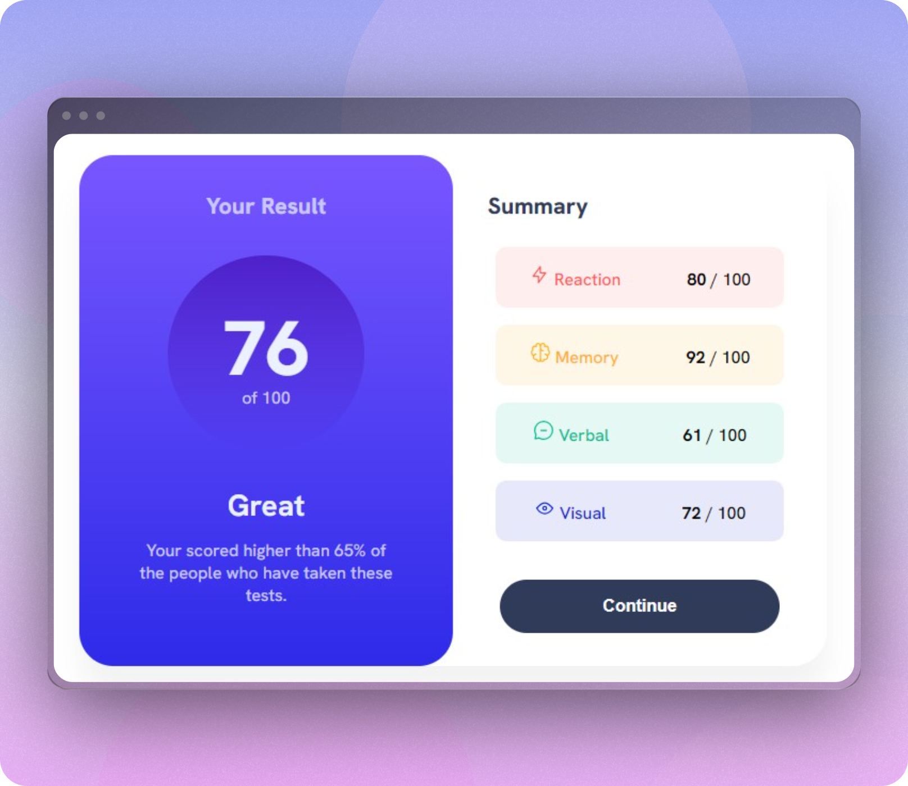

# Frontend Mentor - Results summary component solution

## Table of contents

- [Screenshot](#screenshot)
- [Links](#links)
- [My process](#my-process)
  - [Built with](#built-with)
  - [What I learned](#what-i-learned)
  - [Continued development](#continued-development)
  - [Useful resources](#useful-resources)
- [Author](#author)
- [Acknowledgments](#acknowledgments)

### Screenshot

### Links

- Solution URL: [Project on GitHub](https://github.com/Mesherskaja/results-summary-component-main)
- Live Site URL: [Project on Vercel](https://results-summary-component-main-sable.vercel.app)

## My process

### Built with

- Semantic HTML5 markup
- CSS custom properties
- Flexbox
- CSS Grid
- Mobile-first workflow
- Pseudo-elements : before, : hover
- Pseudo-class selector: root

### Continued development
Improving CSS skills and implementing JS are priority positions.

### Useful resources

- [Color model to define colors](https://rgb.to/rgb/80,80,80) - This helped me easily manipulate and adjust colors in CSS.
- [GridGarden](https://cssgridgarden.com) - This amazing game helped me to train grid.
- [Markdown docs](https://docs.github.com/en/get-started/writing-on-github/getting-started-with-writing-and-formatting-on-github/basic-writing-and-formatting-syntax) - A lot of usefull info for this readme.

## Author

- Website - [Here will be a link to my portfolio](https://www.frontendmentor.io/profile/Mesherskaja)
- Frontend Mentor - [@Mesherskaja](https://www.frontendmentor.io/profile/Mesherskaja)
## Acknowledgments

I wanted to say thanks to the [Discord community](https://discord.com/channels/824970620529279006/1098309837907038260) for helping me get out of a deadlock, and personally [@tajwararik](https://www.frontendmentor.io/profile/tajwararik) to for the project ideas that I observed in her solution.

